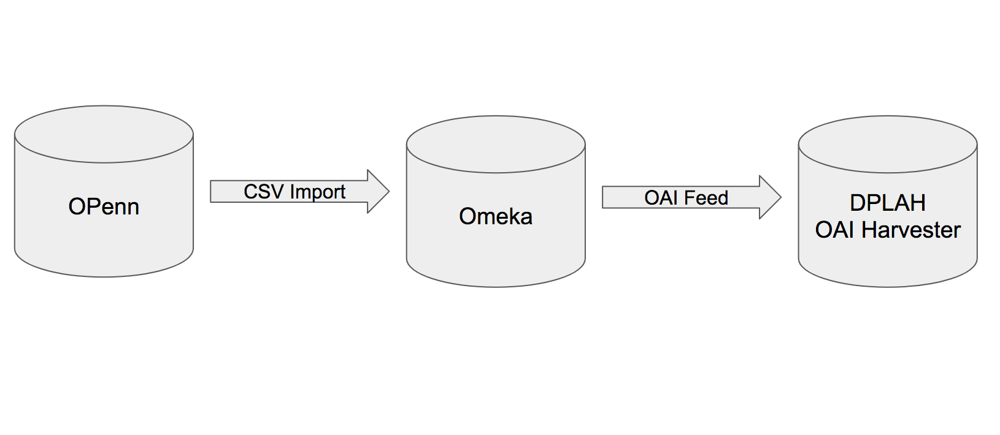
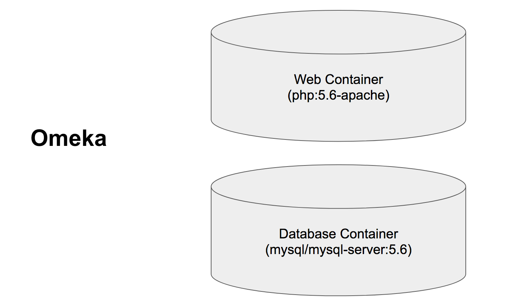
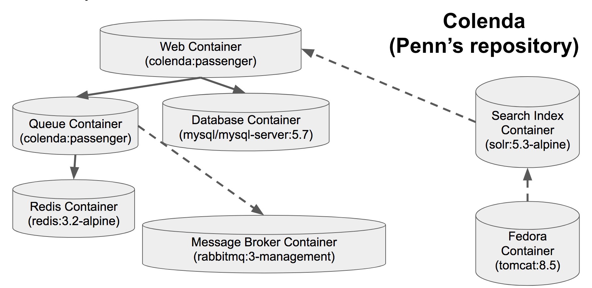

# Developer Workspaces Panel
## Developing with Docker

Kate Lynch

Senior Application Developer, University of Pennsylvania Libraries

@fa[twitter] @katelynch

@fa[envelope] katherly@upenn.edu

---
# Docker for development

* Dockerized services as shared components

* Reducing toil by automating repetitive operations tasks
* Greater parity

---
# Example: DPLA harvesting workflow

---
# Example: Services in isolation

---
# Example: Services in isolation

---
# Video: Docker IN ACTION!

---
# Docker for development

* Not a VM replacement
  * ~~"Before, we were doing everything manually"~~

* Faster setup for shared applications

* Enforces reproducibility
  * Greatly reduces inconsistency
  * Narrows focus in troubleshooting
